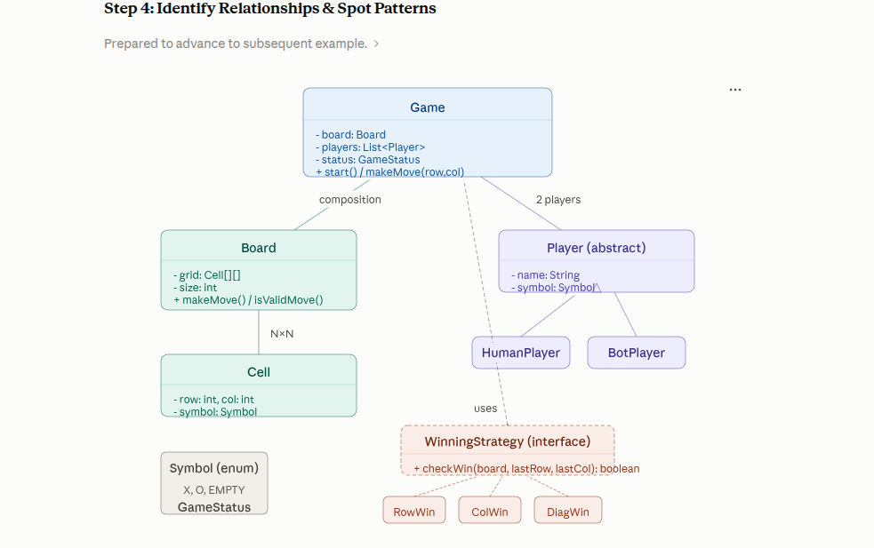

# LLD Problem #2: Tic-Tac-Toe

Solved using the same 7-step framework.

---

## Step 1: Clarify Requirements (3-5 min)

| Question | Typical Answer |
|---|---|
| Board size? | 3×3 (classic), but design for N×N |
| How many players? | 2 players |
| Player types? | Human vs Human (extend for Human vs Computer) |
| What are the symbols? | X and O |
| How to determine winner? | Row, column, or diagonal filled by same player |
| Can a game end in a draw? | Yes, when the board is full with no winner |
| Undo move? | Not required (mention as extension) |
| Multiple games? | One game at a time, restart supported |

### Final Requirements
- N×N board (default 3×3).
- 2 players, each with a unique symbol (X, O).
- Players take turns placing their symbol on an empty cell.
- Game ends when:
  - a player completes a row/column/diagonal (**WIN**), or
  - the board is full (**DRAW**).
- Support Human players (extensible for Bot/AI players).

---

## Step 2: Identify Entities (Nouns)

> "Board with cells. Two players with symbols. Game manages turns. Check for winner."

| Category | Classes |
|---|---|
| Core | `Game`, `Board`, `Cell` |
| Players | `Player` (abstract), `HumanPlayer`, `BotPlayer` |
| Enums | `Symbol` (X, O, EMPTY), `GameStatus` (IN_PROGRESS, WIN, DRAW) |
| Strategy | `WinningStrategy` (interface) |

---

## Step 3: Identify Actions (Verbs)

| Verb | Class | Method |
|---|---|---|
| Place symbol | `Board` | `makeMove(row, col, symbol)` |
| Check winner | `WinningStrategy` | `checkWin(board, lastMove)` |
| Switch turn | `Game` | `nextTurn()` |
| Start game | `Game` | `start()` |
| Validate move | `Board` | `isValidMove(row, col)` |

---

## Step 4: Identify Relationships & Spot Patterns



- `Game` owns `Board` and the list of `Player`s.
- `Board` owns a `Cell[][]` grid.
- `HumanPlayer` and `BotPlayer` extend `Player`.
- `Game` uses `WinningStrategy` implementations (Row, Col, Diagonal, AntiDiagonal).

---

## Step 5: Pattern Identification

| Requirement | Trigger | Pattern |
|---|---|---|
| Check win by row, column, or diagonal | Multiple algorithms for the same check | **Strategy**: `RowWinStrategy`, `ColWinStrategy`, `DiagonalWinStrategy`, `AntiDiagonalWinStrategy` |
| Human or Bot player | Different types of players | **Inheritance**: abstract `Player` with `HumanPlayer`, `BotPlayer` |
| Board owns cells | Parent creates and owns children | **Composition**: `Board` creates its `Cell[][]` |
| Game manages board + players | Central orchestrator | **Composition**: `Game` owns `Board` and `Player`s |

### Why Strategy for the winning check?
Without it, everything ends up in one giant method:

```java
// BAD: one giant method checking everything
if (checkRow() || checkCol() || checkDiag() || checkAntiDiag()) { ... }
```

With Strategy:
- Each check is a separate class.
- Adding a new win condition (e.g. "4 corners" on a bigger board) = a new class, zero changes elsewhere.

---

## Step 6: Complete Java Code

Source is in `src/main/java/org/example/`:
- **Core**: `Game.java`, `Board.java`, `Cell.java`, `Main.java`
- **Players**: `Player.java`, `HumanPlayer.java`, `BotPlayer.java`
- **Enums**: `Symbol.java`, `GameStatus.java`
- **Strategies**: `WinningStrategy.java`, `RowWinStrategy.java`, `ColWinStrategy.java`, `DiagonalWinStrategy.java`, `AntiDiagonalWinStrategy.java`

---

## Step 7: Interview Follow-ups

| Follow-up | How to answer |
|---|---|
| How to add undo? | Use the **Command pattern**: store each move as a `Command` with `undo()`, and keep a stack of moves. |
| How to add an AI bot? | Create `AIPlayer extends Player` with minimax in `getMove()`. Use Strategy for difficulty (Easy = random, Hard = minimax). |
| How to support 5×5 with win-length 4? | Add a `winLength` parameter. Strategies check for `winLength` consecutive symbols instead of a full row/column. |
| How to handle multiplayer (3+ players)? | Already handled: `players` is a `List` and `currentPlayerIndex` cycles via modulo. Add players with unique symbols. |
| How to make it online/real-time? | Add `RemotePlayer extends Player`. Use WebSocket for moves and broadcast game state on each move. |
| Time complexity of win check? | **O(N)** per move: only check the row/column/diagonals of the last move, not the whole board. |

---

## SOLID Scorecard

| Principle | Applied Where |
|---|---|
| **SRP** | `Cell` stores state, `Board` manages the grid, `Game` orchestrates flow, each Strategy checks one condition. |
| **OCP** | New win rule = new Strategy class. New player type = new subclass. Zero changes to `Game`. |
| **LSP** | `HumanPlayer` and `BotPlayer` work wherever `Player` is expected. |
| **ISP** | `WinningStrategy` has one method, so no class implements unused methods. |
| **DIP** | `Game` depends on the `WinningStrategy` interface and `Player` abstraction, not concrete classes. |
